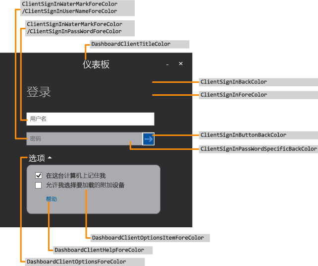
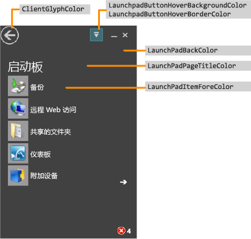
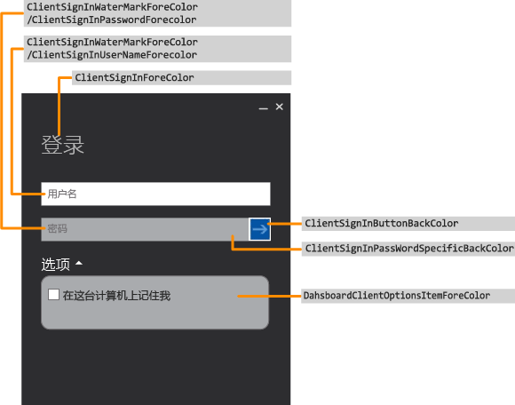
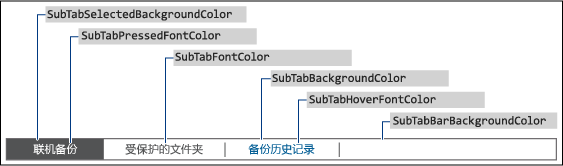
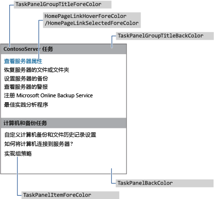
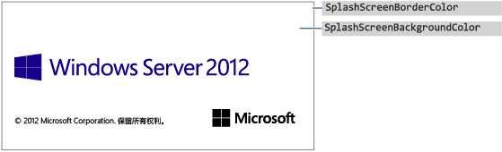
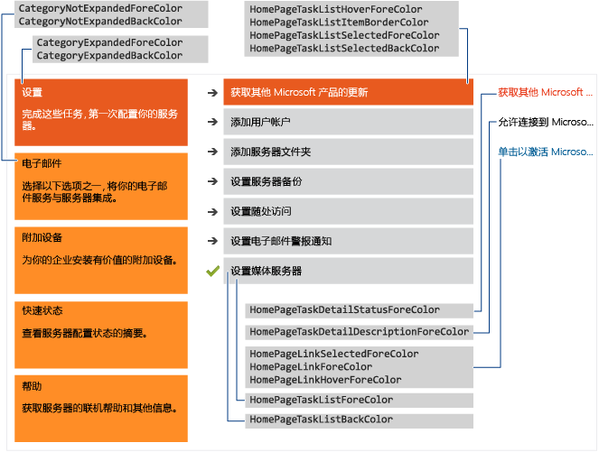

# <a name="change-the-color-scheme-of-the-dashboard-and-launchpad"></a>更改仪表板和快速启动板的配色方案

>适用于：Windows Server 2016 Essentials，Windows Server 2012 R2 Essentials 中，Windows Server 2012 Essentials

你可以通过以下方法更改仪表板和快速启动板的配色方案：在 XML 格式的文件中定义要使用的颜色，再将该 .xml 文件安装在服务器上的一个文件夹中，然后在注册表项中指定该 .xml 文件名。  
  
## <a name="create-the-xml-file"></a>创建 xml 文件  
 下面的示例显示了 .xml 文件中可能包含的内容：  
  
```xml  
<DashboardTheme xmlns="https://www.microsoft.com/HSBS/Dashboard/Branding/2010">  
  
  <!-- Hex color values overwriting default SKU theme colors -->  
  
    <SplashScreenBackgroundColor HexValue="FFFFFFFF"/>  
    <SplashScreenBorderColor HexValue="FF000000"/>  
    <MainHeaderBackgroundColor HexValue="FF414141"/>  
    <MainTabBackgroundColor HexValue="FFFFFFFF"/>  
    <MainTabFontColor HexValue="FF999999"/>  
    <MainTabHoverFontColor HexValue="FF0072BC"/>  
    <MainTabSelectedFontColor HexValue="FF0072BC"/>  
    <MainButtonPressedBackgroundColor HexValue="FF0072BC"/>  
    <MainButtonFontColor HexValue="FFFFFFFF"/>  
    <MainButtonBorderColor HexValue="FF6E6E6E"/>  
    <ScrollButtonBackgroundColor HexValue="FFF0F0F0"/>  
    <ScrollButtonArrowColor HexValue="FF999999"/>  
    <ScrollButtonHoverBackgroundColor HexValue="FF999999"/>  
    <ScrollButtonHoverArrowColor HexValue="FF6E6E6E"/>  
    <ScrollButtonSelectedBackgroundColor HexValue="FF6E6E6E"/>  
    <ScrollButtonSelectedArrowColor HexValue="FFFFFFFF"/>  
    <ScrollButtonDisabledBackgroundColor HexValue="FFF8F8F8"/>  
    <ScrollButtonDisabledArrowColor HexValue="FFCCCCCC"/>  
    <AlertTextBlockBackground HexValue="FFFFFFFF"/>  
    <AlertTextBlockFont HexValue="FF000000"/>  
    <FontColor HexValue="FF000000"/>  
    <SubTabBarBackgroundColor HexValue="FFFFFFFF"/>  
    <SubTabBackgroundColor HexValue="FFFFFFFF"/>  
    <SubTabSelectedBackgroundColor HexValue="FF414141"/>  
    <SubTabBorderColor HexValue="FF787878"/>  
    <SubTabFontColor HexValue="FF787878"/>  
    <SubTabHoverFontColor HexValue="FF0072BC"/>  
    <SubTabPressedFontColor HexValue="FFFFFFFF"/>  
    <ListViewColor HexValue="FFFFFFFF"/>  
    <PageBorderColor HexValue="FF999999"/>      
    <LaunchpadButtonHoverBorderColor HexValue="FF6BA0B4"/>  
    <LaunchpadButtonHoverBackgroundColor HexValue="FF41788F"/>  
    <ClientArrowColor HexValue="FFFFFFFF"/>  
    <ClientGlyphColor HexValue="FFFFFFFF"/>  
    <SplitterColor HexValue="FF83C6E2"/>  
    <HomePageBackColor     HexValue="FFFFFFFF"/>  
    <CategoryNotExpandedBackColor HexValue="FFFFB343"/>  
    <CategoryExpandedBackColor HexValue="FFF26522"/>  
    <CategoryNotExpandedForeColor HexValue="FF2A2A2A"/>  
    <CategoryExpandedForeColor HexValue="FFFFFFFF"/>  
    <HomePageTaskListForeColor    HexValue="FF2A2A2A"/>  
    <HomePageTaskListBackColor HexValue="FFEAEAEA"/>  
    <HomePageTaskListHoverForeColor      HexValue="FF2A2A2A"/>  
    <HomePageTaskListItemBorderColor     HexValue="FF999999"/>  
    <HomePageTaskListSelectedForeColor   HexValue="FFFFFFFF"/>  
    <HomePageTaskListSelectedBackColor   HexValue="FFF26522"/>  
    <HomePageTaskDetailStatusForeColor   HexValue="FFF26522"/>  
    <HomePageTaskDetailDescriptionForeColor     HexValue="FF2A2A2A"/>  
    <HomePageLinkForeColor HexValue="FF0072BC"/>  
    <HomePageLinkSelectedForeColor HexValue="FF0054A6"/>  
    <HomePageLinkHoverForeColor   HexValue="FF0072BC"/>  
    <PropertyFormForeColor HexValue="FF2A2A2A"/>  
    <PropertyFormTabHoverColor HexValue="FF0072BC"/>  
    <PropertyFormTabSelectedColor HexValue="FFFFFFFF"/>  
    <PropertyFormTabSelectedBackColor HexValue="FF414141"/>  
    <TaskPanelBackColor HexValue="FFFFFFFF"/>  
    <TaskPanelItemForeColor HexValue="FF2A2A2A"/>  
    <TaskPanelGroupTitleForeColor HexValue="FF2A2A2A"/>  
    <TaskPanelGroupTitleBackColor HexValue="FFCCCCCC"/>  
    <DashboardClientBackColor HexValue="FF004050"/>  
    <DashboardClientTitleColor HexValue="FFFFFFFF"/>  
    <DashboardClientOptionsForeColor HexValue="FFFFFFFF"/>  
    <DashboardClientOptionsItemForeColor HexValue="FF2A2A2A"/>  
    <DashboardClientHelpForeColor HexValue="FF0054A6"/>  
    <ClientSignInForeColor HexValue="FFFFFFFF"/>  
    <ClientSignInWaterMarkForeColor HexValue="FF999999"/>  
    <ClientSignInUserNameForeColor HexValue="FF2A2A2A"/>  
    <ClientSignInPassWordSpecificBackColor HexValue="FFCCCCCC"/>  
    <ClientSignInButtonBackColor HexValue="FF004050"/>  
    <ClientSignInPassWordForeColor HexValue="FF2A2A2A"/>  
    <LaunchPadBackColor HexValue="FF004050"/>  
    <LaunchPadPageTitleColor HexValue="FFFFFFFF"/>  
    <LaunchPadItemForeColor HexValue="FFFFFFFF"/>  
  <LaunchPadItemHoverColor HexValue="33FFFFFF"/>  
  <LaunchPadItemIconBackgroundColor HexValue="F2004050"/>  
</DashboardTheme >  
  
```  
  
> [!IMPORTANT]
>  必须按照上述示例中所列的顺序来指定 xml 元素。  
  
> [!NOTE]
>  HexValue 属性的所有值均是表示颜色的十六进制值。 你可以输入任何要使用的十六进制颜色值。  
  
 使用记事本或 Visual Studio 2010 创建包含适用于要自定义的区域的标记的 .xml 文件。 可以为该文件指定任意名称，但扩展名必须为 .xml。 有关仪表板和快速启动板上可自定义的区域的说明，请参阅[可以更改的仪表板和快速启动板区域](Change-the-Color-Scheme-of-the-Dashboard-and-Launchpad.md#BKMK_Dashboard)。  
  
#### <a name="to-install-the-xml-file"></a>安装 .xml 文件  
  
1.  在服务器上，将鼠标移动到屏幕右上角，然后单击 **“搜索”**。  
  
2.  在搜索框中，键入 **“regedit”**，然后单击 **“Regedit”** 应用程序。  
  
3.  在左侧窗格中，依次展开 **“HKEY_LOCAL_MACHINE”**、 **“SOFTWARE”**、 **“Microsoft”** 和 **“Windows Server”**。 如果 **“OEM”** 项不存在，则你必须完成下列步骤来创建它：  
  
    1.  右键单击 **“Windows Server”**，指向 **“新建”**，然后单击 **“项”**。  
  
    2.  键入 **OEM** 作为该项的名称。  
  
4.  右键单击 **“OEM”**，指向 **“新建”**，然后单击 **“字符串值”**。  
  
5.  输入 **CustomColorScheme** 作为字符串名称，然后按 **Enter**。  
  
6.  右键单击右侧窗格中的 **CustomColorScheme**，然后单击 **“修改”**。  
  
7.  输入文件名，然后单击 **“确定”**。  
  
8.  将文件复制到 %programFiles%\Windows Server\Bin\OEM。 如果 OEM 目录不存在，请创建该目录。  
  
##  <a name="BKMK_Dashboard"></a> 可以更改的仪表板和快速启动板区域  
 本节包含可以自定义的仪表板和快速启动板区域的示例。  
  
### <a name="examples"></a>示例  
  
####  <a name="BKMK_Figure1"></a> 图 1:仪表板登录页  
   
  
####  <a name="BKMK_Figure2"></a> 图 2:快速启动板  
   
  
####  <a name="BKMK_Figure3"></a> 图 3:快速启动板登录页  
   
  
####  <a name="BKMK_Figure4"></a> 图 4:仪表板文本  
   
  
####  <a name="BKMK_Figure5"></a> 图 5:子表边框  
   
  
####  <a name="BKMK_Figure6"></a> 图 6:任务窗格  
   
  
####  <a name="BKMK_Figure9"></a> 图 7a:产品初始屏幕  
   
  
#### <a name="figure-7b-home-page"></a>图 7b：主页  
   
  
## <a name="see-also"></a>请参阅  
 [创建和自定义映像](Creating-and-Customizing-the-Image.md)   
 [其他自定义设置](Additional-Customizations.md)   
 [部署准备的映像](Preparing-the-Image-for-Deployment.md)   
 [测试客户体验](Testing-the-Customer-Experience.md)